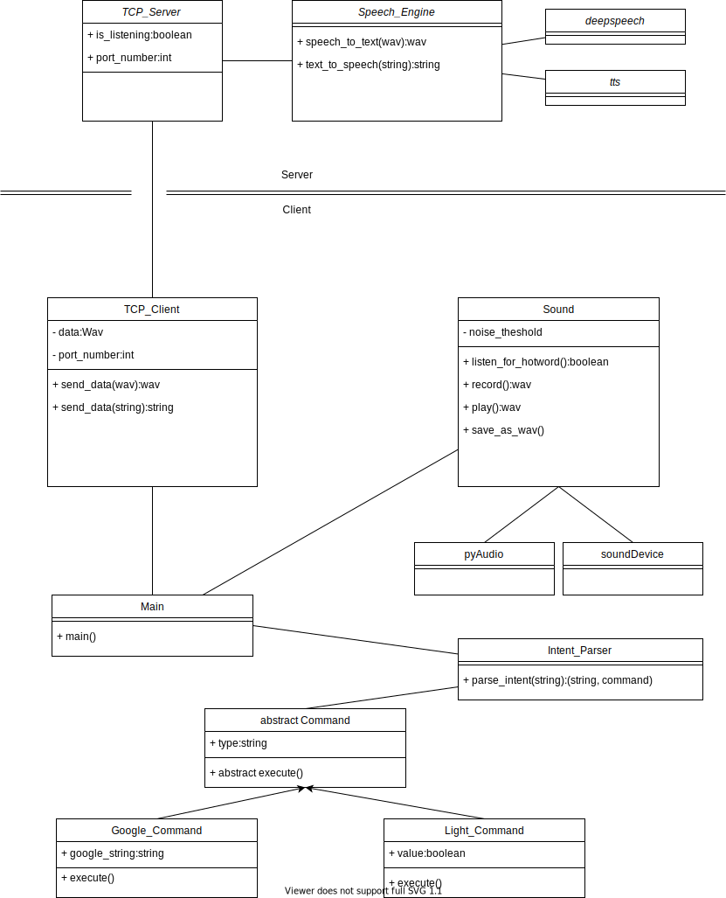

# IoT Speechprocessing Group A

## Funktionalität

- Soundaufnahme
- Abspielen der Aufnahme
- Kommandozeile zum ausführen der Funktionen

## Setup

### Voraussetzungem

Zur Entwicklung, wurde __[`Python 3.6.5`](https://www.python.org/)__ unter __[`Ubuntu 18.04`](http://releases.ubuntu.com/18.04/)__ verwendet, diese Version funktioniert also, andere möglicherweise auch, wurden aber nicht getestet.
Außerdem werden __[`sounddevice`](https://python-sounddevice.readthedocs.io/en/0.3.15/)__ und __[`portaudio`](http://www.portaudio.com/)__ benötigt.

###  Installation

#### Per Skript

Einfach 

> ./setup.sh

ausführen (falls die Datei noch nicht ausführbar ist, kann man das mit `chmod +x setup.sh`) machen.

#### Manuell

__[`sounddevice`](https://python-sounddevice.readthedocs.io/en/0.3.15/)__ kann über __[`pip`](https://pypi.org/project/pip/)__ installiert werden:

> `pip install sounddevice`

__[`portaudio`](http://www.portaudio.com/)__ ist kein __[`Python`](https://www.python.org/)__ Modul und wird deshalb über das Betriebssystem installiert:

> `sudo apt install python3-pyaudio`

## Client ausführen

Nach der [Installation](#installation) kann `client/main.py` ausgeführt werden:

> python client/main.py

Dabei sollte __[`Python`](https://www.python.org/)__ auch wirklich __[`Python 3.6.5`](https://www.python.org/)__ unter __[`Ubuntu 18.04`](http://releases.ubuntu.com/18.04/)__ aufrufen, gegebenenfalls sollte man also

> python3 client/main.py

verwenden.

## Porgrammarchitetkurübersicht

Folgendes Klassendigramm in `UML` stellt die Architektur des Programms dar. Die Übersicht ist nur vorläufig und kann sich noch ändern, sollte aber im Prinzip eingehalten werden.

